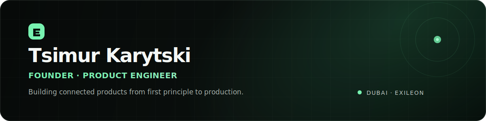

  

  <a href="https://exileon.net">Exileon</a>&nbsp;&nbsp;·&nbsp;&nbsp;
  <a href="https://github.com/ts7mur?tab=repositories">Projects</a>&nbsp;&nbsp;·&nbsp;&nbsp;
  <a href="mailto:bognerov@gmail.com">Contact</a>

## Building products that feel complete

I am a product engineer and founder based in Dubai. I work across product strategy, interface design, frontend engineering, backend systems and launch operations.

My current focus is **[Exileon](https://exileon.net)**, a platform that gives players one identity for their games, teams, communities, reputation and next opportunity.

<table>
  <tr>
    <td width="50%" valign="top">
      <strong>Product</strong>  
      Turn broad ideas into focused user journeys, clear interfaces and measurable activation loops.
    </td>
    <td width="50%" valign="top">
      <strong>Engineering</strong>  
      Build production web systems with secure data access, authentication, realtime features and edge delivery.
    </td>
  </tr>
  <tr>
    <td width="50%" valign="top">
      <strong>Design</strong>  
      Create restrained visual systems, responsive layouts and motion that supports the experience.
    </td>
    <td width="50%" valign="top">
      <strong>Operations</strong>  
      Ship, observe, protect and improve the product after it reaches real users.
    </td>
  </tr>
</table>

## Current build

### Exileon

**The player layer for gaming.**

Exileon brings gaming identity, teams, communities, vacancies, verified reputation and discovery into one platform. I am building the product end to end, from the interaction model and visual language to the data model, security boundaries and production deployment.

`React` `Vite` `Supabase` `PostgreSQL` `Cloudflare Workers` `RLS` `Realtime`

[Open Exileon](https://exileon.net)

## Selected work

| Project | What it demonstrates | Stack |
| :--- | :--- | :--- |
| **[Exileon](https://exileon.net)** | Product architecture, social systems, identity, communities, recruitment and trust | React, Supabase, Cloudflare |
| **[Seller Dashboard](https://seller-dash-wine.vercel.app)** | Operational dashboard design and data-driven workflows | Next.js, React, Supabase |
| **[Currency & Profit Calculator](https://github.com/ts7mur/currency-calculator)** | A focused utility built to remove repetitive business calculations | Python, Streamlit, APIs |

## How I work

- Start with the user action that creates real value.
- Keep the interface quiet, precise and fast.
- Treat authorization and data ownership as product requirements.
- Ship in small increments, test with real usage and refine deliberately.
- Build systems that can outgrow the first use case.

## Toolkit

**Product engineering:** JavaScript, React, Next.js, Vite, Python 
**Data and backend:** PostgreSQL, Supabase, authentication, row-level security, realtime systems 
**Infrastructure:** Cloudflare Workers, edge delivery, rate limiting, production monitoring 
**Product craft:** UX architecture, interface systems, responsive design, motion, product strategy

 

  <strong>Building Exileon in public, one production release at a time.</strong> 
  Dubai, UAE · Open to thoughtful conversations about products, gaming infrastructure and ambitious ideas.

